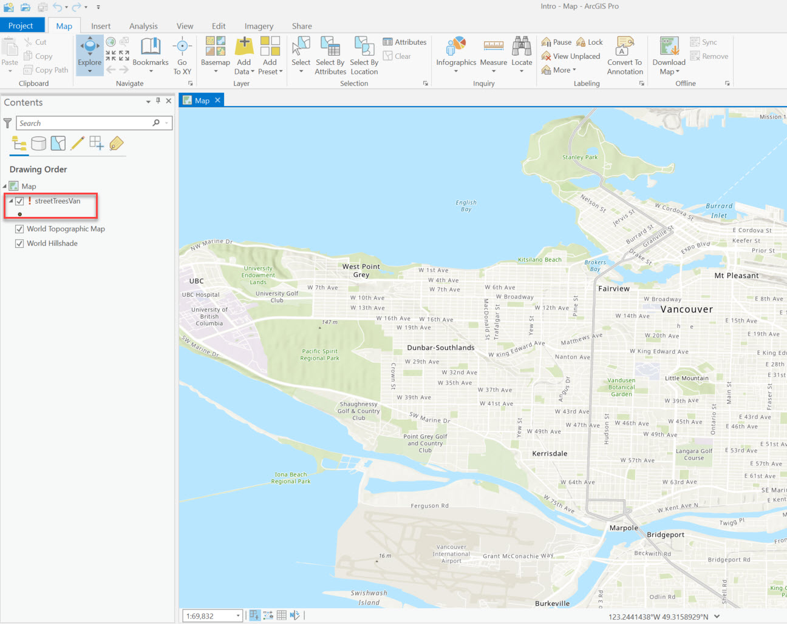

### STARTING A PROJECT
### Map Projects

So what exactly is an **ArcGIS Pro Project**? When you first add a blank map and begin "_adding_" data and creating different symbologies, labeling schemes, etc., you are modifying a Map Project. The word _adding_ is emphasized because you are not actually adding data. Instead, you are _linking_ data using file paths. The reason for this is because often times GIS data is several megabytes or even gigabytes in file size. Having all of that data displayed in your map project would be impractical and taxing on your computer. So, the project doesn't actually contain the data, but only links to it. Map Projects are then configured with styles, symbologies, labels, etc.

### Fixing Broken Links

The layers (in your **Contents Pane**) might have a small :exclamation: next to them. This means that you're experiencing the **Broken Link** issue - which is VERY common when working in GIS with layers and the paths pointing to them. You'll need to fix them to continue.

*1*{: .circle .circle-blue} Click on the red :exclamation: next to the **househldPopMotherTong_joinToThis** layer in the **Contents** pane.

*2*{: .circle .circle-blue} Navigate to the **Intro.gdb** of the tutorial dataset and select the feature dataset that corresponds to the layer you clicked and select **OK**.

Since all your layers are in the same directory, all of your layers should now be repaired. It's generally good practice to have your data organized logically, which will help to fix the inevitable broken link issue.
