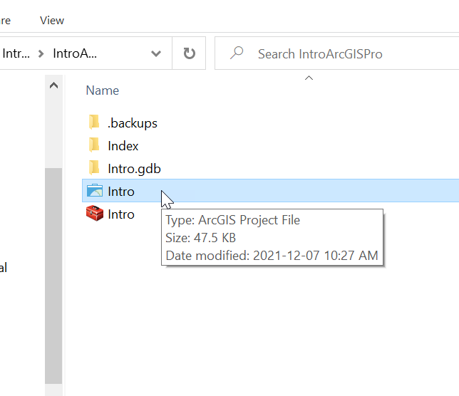
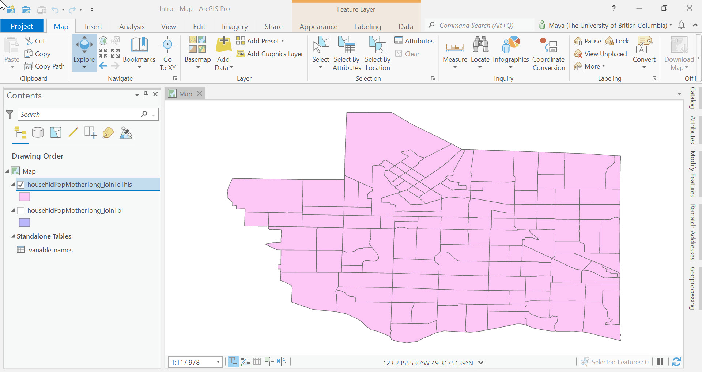

### USER INTERFACE
ArcGIS Pro is the latest desktop GIS software from the software company Esri and will eventually replace ArcMap. This software must be purchased, downloaded, installed, and configured on your computer for it to work as intended.

Open the software and get familiar with the default user interface.

*1*{: .circle .circle-blue} From your **Downloads** folder where you have extracted the data for this workshop, drill down into your **IntroArcGISPro** folder until you see multiple files.

*2*{: .circle .circle-blue} Double-click on the **Intro** project file (.**aprx**), to open an ArcGIS Pro map.

You should see something like this:

### Signing into ArcGIS Pro
If you weren't already prompted to sign into your ArcGIS Online or UBC ArcGIS account, make sure to do so now. One of the advantages to ArcGIS Pro is its seamless connection to and interaction with ArcGIS Online and all of the layers and basemaps available.

*1*{: .circle .circle-blue} From the upper right of your map window, click the dropdown menu next to **Not signed in** and select **Sign in**.

*2*{: .circle .circle-blue} Sign into your ArcGIS Online account.

### Main UI Components
The ArcGIS Pro user interface (UI) has a few main components:
- The **Map Frame**: This is where your data will be visualized.
- The **Contents Pane**: This will likely be your most used "tabbed" window because it's where you'll interact with your data. As you add data to your project, they will appear here as **layers**.
- The **Catalogue Pane**: This pane is similar to Windows Explorer, or Mac Finder. You can create connections to data sources (drives, folders, networks, etc.) and perform several data maintenance and management tasks in this pane. The search option is also available here, which is used to search for tools, documents, and data.
- **Menu Tabs**: These are located at the top of the main UI and can be  selected/activated as needed. We will use these later in the tutorial.

### Interact with Tabbed Menus
 Move your cursor to the **Contents Pane**, and notice the small down arrow on the right side. If clicked, this arrow give you options to **Float**, **Dock**, **Auto-Hide**, and **Close** the pane.    

Using the **Catalog Title Bar**, click and drag the Catalog Pane away from its docked position. Notice the "docking arrows" that appear as you move the window. You can find the Catalog Pane under the **View** menu if you don't already see it docked to the right of your map frame.

### Explore the Windows (Catalog)

*1*{: .circle .circle-blue} Right-click on the folders item in the **Catalog Pane**, then select **Add Folder Connection**> Add Folder**

*2*{: .circle .circle-blue} Select the **Downloads** icon and click **OK**.

*3*{: .circle .circle-blue} Expand the resulting **Folder Connection** in the **Catalog Pane**, the **IntroArcGISPro** folder, and then the **Intro.gdb**.

There should be four [feature classes](https://pro.arcgis.com/en/pro-app/latest/help/data/geodatabases/overview/feature-class-basics.htm) and one table in this geodatabase. A geodatabase helps us organize data collections in ArcGIS projects.
